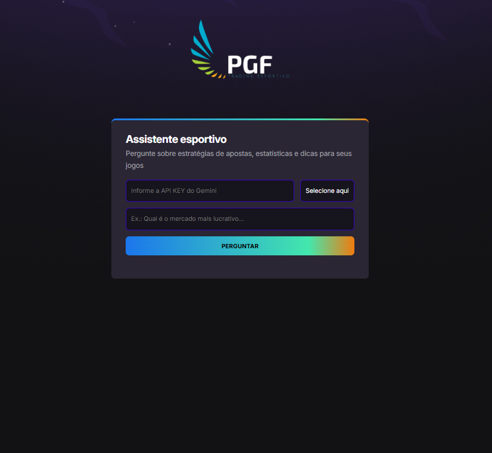
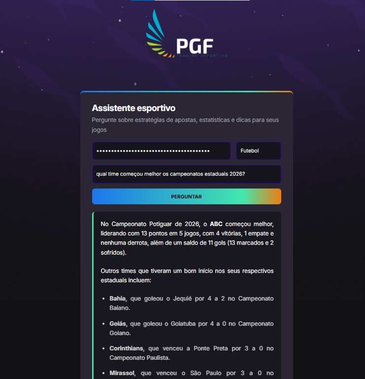

# 🧠 Assistente Esportivo com IA (Gemini API)

[🇧🇷 Português](#-português) | [🇺🇸 English](#-english)

---

## 🇧🇷 Português

### 🚀 Visualização online

🔗 [Clique aqui para acessar a página](https://helensjferreira-dev.github.io/assistente-esportivo/)

<p align="center">
  
  
</p>

---

### 📝 Sobre o Projeto

Aplicação web que utiliza Gemini API (LLM) para responder perguntas esportivas de forma contextualizada, com interface responsiva e integração em tempo real.

---

### 📁 Estrutura de arquivos

```text
├── index.html
├── style.css
├── script.js
├── assets/
│   ├── bg.jpg
│   ├── pgf.png
│   ├── 00-consulta.png
│   └── consulta.png
├── LICENSE
└── README.md
```

---

### 🚀 Funcionalidades

- ✅ Respostas inteligentes sobre esportes (futebol, basquete, vôlei, etc.).

- ✅ Interface web responsiva em HTML + CSS + JavaScript.

- ✅ Suporte a três esportes: futebol, basquete e poker e perguntas variadas.
- ✅ Exibição formatada das respostas com Markdown.
- ✅ Uso de ferramentas externas para contexto atualizado.

---

### 🛠️ Tecnologias utilizadas

- HTML5
- CSS3
- JavaScript (ES6+)
- [Gemini API](https://ai.google.dev/)
- Bibliotecas: [Showdown.js (renderização Markdown)](https://github.com/showdownjs/showdown)
- Ferramentas: Git/GitHub

---

### 📦 Como executar

1. Clone o repositório:

   ```bash
   git clone https://github.com/helensjferreira-dev/assistente-esportivo.git

   ```

2. Abra o arquivo index.html no navegador.

3. Insira sua API Key do Gemini no campo indicado.

```bash
Aviso: "Sua API Key é processada apenas localmente no seu navegador e não é armazenada em nenhum servidor externo."
```

4. Escolha o esporte e faça sua pergunta.

### 💡 Exemplos de Uso

- “Quem foi o artilheiro da Copa de 2002”

- “Vale a pena apostar no over 2.5 nos jogos da Premier League?”

- "Qual mercado é mais seguro para apostar em jogos da Série B do Brasileiro?"

- "Quais times têm melhor aproveitamento no 1º quarto?"
- “Qual estratégia funciona melhor em torneios de poker Sit & Go?”

### 📈 Próximos Passos

- Adicionar histórico de perguntas e respostas.

- Implementar autenticação de usuários.

- Criar versão mobile com PWA.

- Cache de respostas para reduzir chamadas à API.

- Dockerizar aplicação para facilitar deploy.

### 📄 Licença

Este projeto está sob a licença MIT. Veja o arquivo LICENSE para mais detalhes.

👤 Autora Hélen Ferreira Desenvolvedora  
📸 [Linkedin](https://www.linkedin.com/in/helensjferreira-dev/)
💬 [WhatsApp](https://wa.me/5548988183720)
🔗 [GitHub](https://github.com/helensjferreira-dev/assistente-esportivo)

<br><br>

---

## 🇺🇸 English

# 🧠 Sports Assistant with AI (Gemini API)

### 🚀 Online Demo

🔗 [Click here to access the page](https://helensjferreira-dev.github.io/assistente-esportivo/)

<p align="center">
  
  

</p>

---

### 📝 About the Project

Web application that uses **Gemini API (LLM)** to answer sports-related questions in a contextualized way, with a responsive interface and real-time integration.

---

### 📁 File Structure

```text
├── index.html
├── style.css
├── script.js
├── assets/
│   ├── bg.jpg
│   ├── pgf.png
│   ├── 00-consulta.png
│   └── consulta.png
├── LICENSE
└── README.md
```

---

### 🚀 Features

- ✅ Intelligent answers about sports (soccer, basketball, poker, etc.).
- ✅ Responsive web interface built with HTML + CSS + JavaScript.
- ✅ Support for three sports: soccer, basketball, and poker.
- ✅ Formatted responses using Markdown.
- ✅ External tools for updated context.

---

### 🛠️ Technologies Used

- HTML5
- CSS3
- JavaScript (ES6+)
- [Gemini API](https://ai.google.dev/)
- Libraries: [Showdown.js (Markdown rendering)](https://github.com/showdownjs/showdown)
- Tools: Git/GitHub

---

### 📦 How to Run

1. Clone the repository:

   ```bash
   git clone https://github.com/helensjferreira-dev/assistente-esportivo.git

   ```

2. Open the index.html file in your browser.

3. Enter your Gemini API Key in the designated field.
   ```bash
      Security Note: Your API Key is processed only locally within your browser and is not stored on any external server.
   ```
4. Select the sport and ask your question.

### 💡 Usage Examples

- “Who was the top scorer of the 2002 World Cup?”

- “Is it worth betting on over 2.5 goals in Premier League matches?”

- “Which market is safer for betting in Série B games?”

- “Which teams perform better in the 1st quarter?”

- “What strategy works best in Sit & Go poker tournaments?”

---

### 📈 Next Steps

- Add history of questions and answers.

- Implement user authentication.

- Create a mobile version with PWA.

- Cache responses to reduce API calls.

- Dockerize the application for easier deployment.

### 📄 License

This project is licensed under the MIT License. See the LICENSE file for details.

👤 Author
Hélen Ferreira – Developer  
📸 [Linkedin](https://www.linkedin.com/in/helensjferreira-dev/)
💬 [WhatsApp](https://wa.me/5548988183720)
🔗 [GitHub](https://github.com/helensjferreira-dev/assistente-esportivo)
